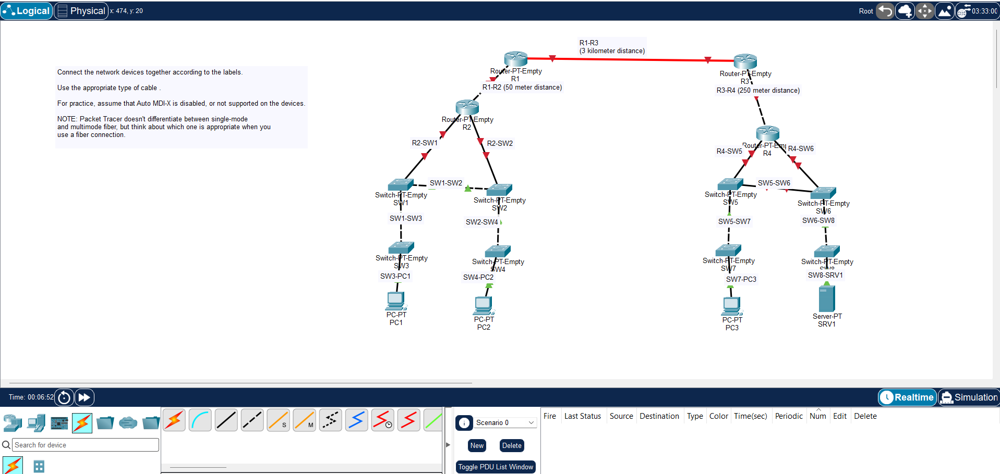

# Day 02 Lab: Cable Management, Media Types & Device Connectivity

## 1. Lab Topology

## 2. Media & Cable Types Overview

### UTP (Unshielded Twisted Pair) Cables

- **Copper Straight-Through:** Connects **dissimilar** devices (e.g., Switch to Router, Switch to PC, Switch to Server).
- **Copper Cross-Over:** Connects **similar** devices (e.g., Switch to Switch, Router to Router, PC to PC, PC to Router).
- **Rollover / Console Cable:** Used for out-of-band management to connect a PC's RS-232/USB port to a Router or Switch Console port.

### Fiber Optic Cables

- **Single-Mode Fiber (SMF):** Uses a thin core and laser light. Designed for long-distance transmissions with high bandwidth and minimal attenuation.
- **Multi-Mode Fiber (MMF):** Uses a wider core and LED light. Designed for shorter-distance runs (e.g., intra-building links or enterprise LAN backbones).

---

## 3. How to Connect Devices in Packet Tracer

1. **Select Connections Tool:** Click the **Lightning Bolt** icon on the bottom-left menu.
2. **Choose Cable Type:**
   - Select **Copper Straight-Through** (solid black line) for Switch-to-PC connections.
   - Select **Copper Cross-Over** (dashed line) for PC-to-PC or Switch-to-Switch connections.
   - Select **Fiber** (dashed orange line) for High-Speed Gigabit/SFP fiber links.
3. **Attach to Interfaces:**
   - Click the source device and select the port (e.g., `FastEthernet0/1` or `GigabitEthernet0/0/0`).
   - Click the destination device and select its corresponding interface.
4. **Verify Link Status:**
   - **Green Light:** Link is up and operational.
   - **Amber Light:** Spanning Tree Protocol (STP) is converging (wait ~30 seconds).
   - **Red Light:** Link is down or the interface is administratively shut down (`shutdown`).
