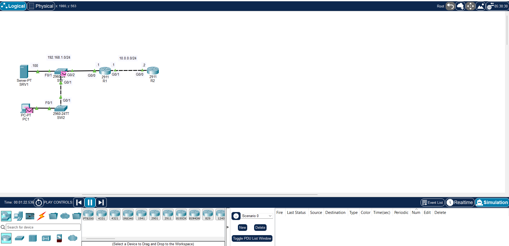

# Free CCNA Day 03 Lab: OSI Model & TCP/IP Suite

## 1. Lab Topology

---

## 2. Lab Objectives

- Observe packet encapsulation and decapsulation using Packet Tracer's Simulation Mode.
- Analyze Protocol Data Unit (PDU) headers across OSI Layers 1–7 / TCP/IP Layers 1–4.
- Examine the differences between TCP and UDP headers.
- Track how network devices (Hubs, Switches, Routers) process PDUs at different layers.

---

## 3. PDU Quick Reference

| Layer # | OSI Layer                            | TCP/IP Layer   | Data Unit (PDU)                    | Key Header Information             |
| :------ | :----------------------------------- | :------------- | :--------------------------------- | :--------------------------------- |
| **5–7** | Application / Presentation / Session | Application    | **Data**                           | HTTP / DNS / SSH Payloads          |
| **4**   | Transport                            | Transport      | **Segment (TCP) / Datagram (UDP)** | Source & Destination Ports         |
| **3**   | Network                              | Internet       | **Packet**                         | Source & Destination IP Addresses  |
| **2**   | Data Link                            | Network Access | **Frame**                          | Source & Destination MAC Addresses |
| **1**   | Physical                             | Network Access | **Bits**                           | Preamble, Voltage / Light Signals  |

---

## 4. Lab Step-by-Step Walkthrough

### Step 1: Enter Simulation Mode

1. Open the Packet Tracer file (`Day 3 Lab - OSI Model.pkt`).
2. Click **Simulation** in the bottom-right corner (or press `Shift + S`).
3. Click **Show All/None** and edit filters to show only: `ICMP`, `HTTP`, `TCP`, and `UDP`.

### Step 2: Generate Traffic & Inspect Encapsulation

1. Open **PC1** -> **Desktop** -> **Web Browser**.
2. Navigate to `192.168.1.100` (Server) and press **Go**.
3. Click **Capture / Forward** step-by-step to send the PDU.
4. Click the envelope icon on the topology to open the **PDU Information** window.
5. Inspect the **In Layers** and **Out Layers** tabs:
   - **Out Layers (PC1):** Notice how Layer 7 data is encapsulated down to Layer 4 (TCP Header), Layer 3 (IP Header), and Layer 2 (Ethernet Header).
   - **In Layers (Switch/Router):** Notice how switches inspect up to Layer 2, while routers strip Layer 2 frames to inspect Layer 3 IP headers.

---

## 5. Key Concept Questions & Takeaways

- **Which device strips the Layer 2 Ethernet header?** Routers (at Layer 3) decapsulate the Layer 2 frame and create a new frame for the next hop.
- **Does a Layer 2 Switch modify IP addresses?** No. Layer 2 switches only process MAC addresses and pass the IP packet untouched.
