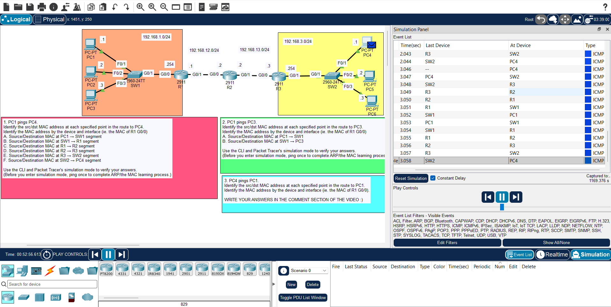

## JEREMY IT LAB DAY 12 LAB :

## OVERVIEW :

- you will learn the life and journey of a packet how it is forwarded and encapsulated and decapsulated .
- this lesson will have no configuration or troubleshooting 
- all you have to do is to observe and learn how packets move across networks via routers and switches 
- use the simulation mode in packet tracer to observe how the packet move from PC1 to PC4 
- try to figure out what are the processes the packet is going to go through until it arrive to it's destination before using simulation mode 
- it is really fascinating how this process occur and we use this everyday but we dont know the magic behind it 