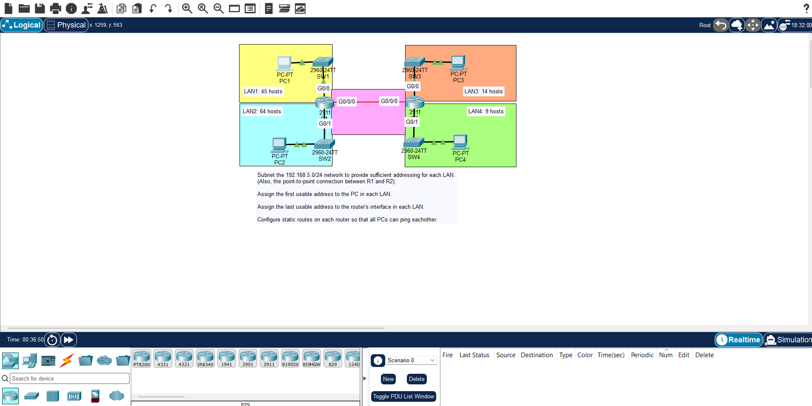

## JEREMY IT LAB DAY 15

## NETWORK TOPOLOGY

## OVERVIEW

- in this lab you will learn how to subnetting and VLSM by subnetting a class C network on four LAN's i really encourage you to take attention in jeremy it lab lessons about this
  because this is an important topic and need focus before moving to the lab . start the lab after you deeply understand sunetting and do some exercises on it and try to do the lab
  by yourself .

## lab points

- you will start by subnetting the network to four lan's from the biggest to smallest so that every lan get it wanted share and also the point to point .
- first you will take 1 it and the prefix should be /27 and from .0 to .128 is the first lan range and to get the broadcast and network address you will make all the host bits zeros for the network address wich will come to 255.255.255.0 .
- and for the broadcast do the same make all the network 7 bits 1's and you will get 255.255.255.128
- keep progression and taking one bit each time from the network bits until you cover all the lans .
- and for the point to point you should make it /29 or /30 not /31 although /31 work perfectly but like jeremy said its not good for the CCNA bacause when you r making a network you should reserve some hosts for the future .
