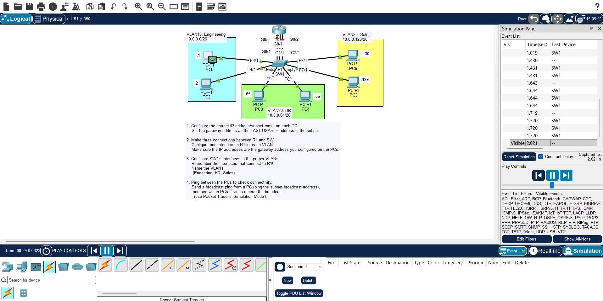

## day 16 lab : vlans configurations 

## overview :

- this is you will get deeper in networking by learning vlans and how to configure them along with practicing subnetting command .
- start by completing step one and assign all the ip to the right devices and subnets .
- if you follow the steps in the lab all by yourself you will chieve your first real network .
- thanks to poeple like jeremy it lab we are able to learn and document and share these valuable free courses and labs .