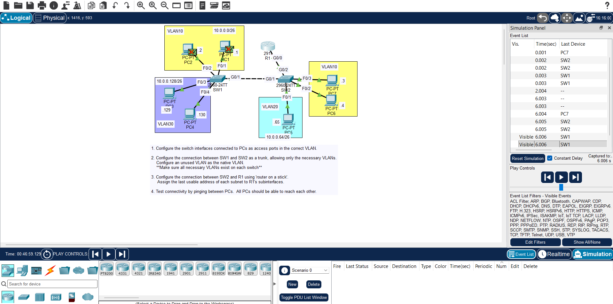

## DAY 17 LAB VLANS PART 2 JEREMY IT LAB

## OVERVIEW

- this lab will solidify your knowledge in vlans and trunks and all the previous lessons .
- do all the steps and try to get used to the new commands for configuring vlans and trunks and ROAS .
- also do the lab multiple times to make sure it get stuck in your head .
- the lab have three steps the first is to configure the vlans on the switches interfaces .
- then do the the routers int to make the three vlans traffic go through the int g0/0.10 and .20 and .30 correctly and double-check your configurations .
- start simulation mode and ping any pc on the same or other vlan to make sure it goes in the right path
