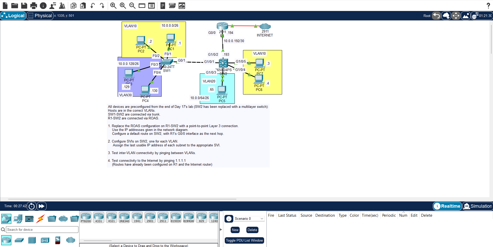

## JEREMY IT LAB DAY 18 LAB : MULTILAYER SWITCHING 

## overview :

- multilayer switching is a complicated topic so you need to practice multiple time to make sure you understand it correctly 

- always try to troubleshoot and solve problem 

- in this lab you will be configuring multilayer switching and vlan and default gateway 
