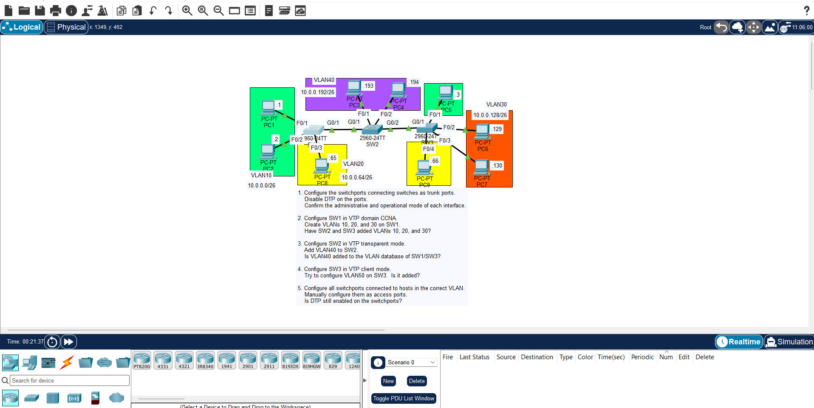

## JEREMY IT LAB DAY 19 : DTP & VTP CONFIGURATION



## overview

- in this lab you will configure vtp and dtp on the three switches and make SW1 the server and SW2 put it in transparent mode and SW3 in client mode
- you will manually configure trunk ports between the switches and disable dynamic trunking protocol (dtp) negotiation to secure the connections
- you will create and manage vlans from the server switch and verify how they propagate across the network according to each switch's vtp mode
- you will configure access ports for the end-host devices and assign them to their respective vlans

## configuration steps

### step 1 : configure manual trunking and disable dtp

- configure the interfaces connecting the switches as static trunk ports and turn off dtp negotiation frame transmissions
- SW1 (G0/1), SW2 (G0/1 - 2), SW3 (G0/1):

  ```ios
  interface <interface-id>
   switchport mode trunk
   switchport no negotiate
  ```

### step 2 : configure vtp server and create vlans

- set up the vtp domain name and password on the server switch, then create the required vlans
- SW1 configuration:

  ```ios
  vtp domain CCNA
  vtp password Cisco
  vlan 10
  vlan 20
  vlan 30
  ```

### step 3 : configure vtp transparent mode

- isolate SW2 from global configuration updates so it only forwards vtp advertisements without altering its own local database
- SW2 configuration:

  ```ios
  vtp mode transparent
  vlan 40
  ```

### step 4 : configure vtp client mode

- configure SW3 to receive vlan database updates dynamically from the server switch
- SW3 configuration:

  ```ios
  vtp mode client
  vtp password Cisco
  ```

### step 5 : configure access ports

- assign the end-host interfaces to access mode and map them to their correct vlans
- SW1: F0/1-2 (VLAN 10), F0/3 (VLAN 20)
- SW2: F0/1-2 (VLAN 40)
- SW3: F0/1 (VLAN 10), F0/2-3 (VLAN 30), F0/4 (VLAN 20)

  ```ios
  interface <interface-id>
   switchport mode access
   switchport access vlan <vlan-id>
  ```

## verification commands

- use these commands to verify your configuration states and operational statuses:
  - `show interface <interface-id> switchport` - check operational trunk status and dtp settings
  - `show vtp status` - verify the vtp operating mode, domain name, and revision number
  - `show vlan brief` - check the active local vlan database entries and interface mappings
