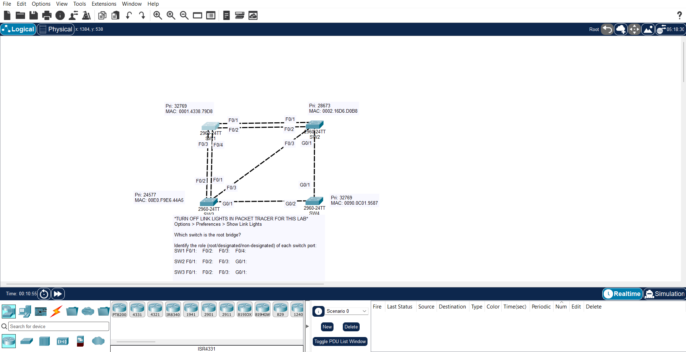

## JEREMY IT LAB DAY 20 : SPANNING-TREE

## tasks :

- in this lab there will be no configuration 
- you will just test and confirm your knowledge on spanning-tree protocol
- you will have to identify the root bridge in the topology and identify the root ports and designated and non designated port 
- and confirm your answers in the CLI 
- by running 
  '''
  en

  show spanning-tree

  '''

- and comparing your answers with the output 