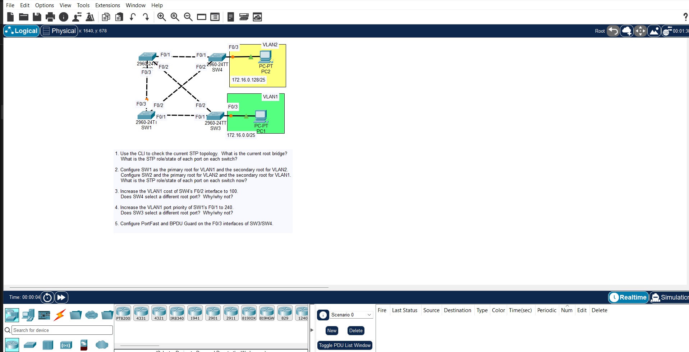

## JEREMY IT LAB DAY 21 : CONFIGURING SPANNING-TREE



```markdown
# JEREMY IT LAB DAY 21: CONFIGURING SPANNING-TREE


---

## OBJECTIVES

- Configure primary and secondary Spanning Tree Protocol (STP) root bridges on SW1 and SW2 using `bridge-priority` values.
- Adjust STP priority settings to ensure SW1 becomes the Root Bridge for VLAN 1 and SW2 becomes the Root Bridge for VLAN 2.
- Modify STP port costs (`spanning-tree cost`) on specific switch interfaces to manually control root port selection.
- Configure PortFast (`spanning-tree portfast`) on access ports connected to PCs so they skip Listening/Learning states.
- Enable BPDU Guard (`spanning-tree bpduguard enable`) on access ports to automatically disable (`err-disable`) any port receiving STP BPDUs.
- Verify STP states, root bridge IDs, and port roles using Cisco verification commands.

---

## CONFIGURATION COMMANDS

### 1. Root Bridge Configuration (PVST+ / RPVST+)

Set primary and secondary root bridges using the macro command:
```

SW1# config t
SW1(config)# spanning-tree vlan 1 root primary
SW1(config)# spanning-tree vlan 2 root secondary

```

Or set explicit priority values manually (must be in increments of 4096):


```

SW1(config)# spanning-tree vlan 1 priority 4096
SW2(config)# spanning-tree vlan 1 priority 8192

```

### 2. Interface Port Cost Adjustments

Change the cost on an interface to alter path selection to the root bridge:


```

SW3# config t
SW3(config)# int g0/1
SW3(config-if)# spanning-tree vlan 1 cost 18

```

### 3. PortFast & BPDU Guard on Access Ports

Enable PortFast and BPDU Guard on user-facing ports:


```

SW3# config t
SW3(config)# int range f0/1 - 10
SW3(config-if)# switchport mode access
SW3(config-if)# spanning-tree portfast
SW3(config-if)# spanning-tree bpduguard enable
SW3(config-if)# exit

```

Enable PortFast globally for all access ports:


```

SW3(config)# spanning-tree portfast default

```

---

## VERIFICATION COMMANDS

Run these in privileged EXEC mode (`#`):

* `show spanning-tree` — Displays full STP info, Root Bridge ID, Local Bridge ID, priority, and port roles/states for all active VLANs.
* `show spanning-tree vlan 1` — Filters output specifically for VLAN 1 details.
* `show spanning-tree summary` — Shows global STP settings, including whether PortFast or BPDU Guard are enabled globally.
* `show interfaces status` — Checks if any ports were placed into `err-disabled` state due to a BPDU Guard violation.

---

## KEY THINGS TO REMEMBER

* **Bridge ID Composition:** Made of `Bridge Priority + System ID Extension (VLAN ID) + MAC Address`.
* **Default Priority:** Default priority on Cisco switches is **32768**. (For VLAN 1, it reads **32769** due to the system ID extension).
* **Port States (STP / 802.1D):** Blocking $\rightarrow$ Listening $\rightarrow$ Learning $\rightarrow$ Forwarding (takes about 30 seconds total).
* **Port States (RSTP / 802.1w):** Discarding $\rightarrow$ Learning $\rightarrow$ Forwarding.
* **Port Roles:**
  * **Root Port (RP):** The single port on a non-root switch with the lowest cost path to the Root Bridge.
  * **Designated Port (DP):** The port forwarding traffic on a collision domain. All active ports on the Root Bridge are DPs.
  * **Alternate Port (AP):** A backup port kept in a blocking/non-forwarding state to prevent switching loops.
* **PortFast Warning:** Only enable PortFast on ports connected to host devices (PCs, servers, printers). Never put PortFast on switch-to-switch trunk links.

```
