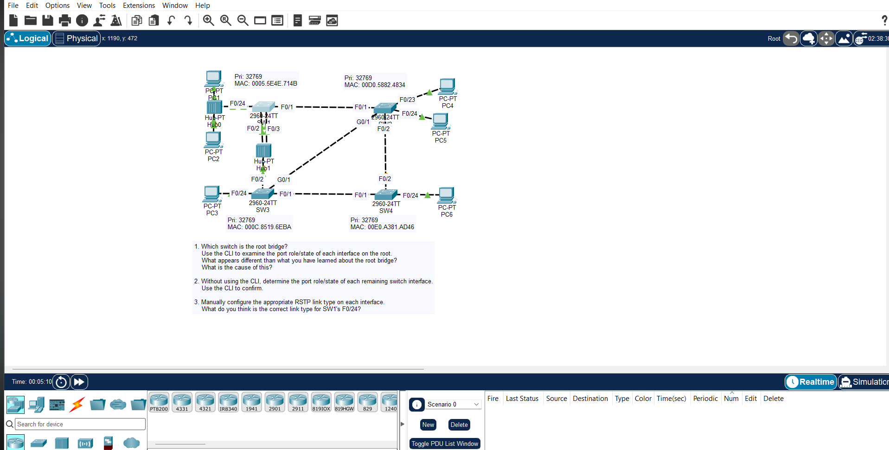

## JEREMY IT LAB DAY 22 : RAPID STP



## Overview

This lab focuses on analyzing the Rapid Spanning Tree Protocol (RSTP / 802.1w) topology based on equal bridge priorities, identifying custom port roles (including alternate and backup ports), and explicitly configuring RSTP link types via the CLI.

## Objectives

1. Identify the Root Bridge based on the lowest MAC address.
2. Determine the RSTP port roles (Root, Designated, Alternate, and Backup) and states for all switch interfaces without using the CLI.
3. Use the CLI to verify the topology calculations.
4. Manually configure the correct RSTP link types (Point-to-Point) and enable PortFast on the appropriate interfaces.

## Topology Analysis Summary

- **Root Bridge Election:** Since all switches share the default priority of 32,769, Switch 1 wins the Root Bridge election because it has the lowest MAC address.
- **The Hub Collision Domain:** Switch 1's F0/3 and F0/22 interfaces connect directly to a shared hub. Because only one Designated Port can exist per collision domain, one port becomes Designated while the other transitions to an RSTP Backup port role in a Discarding state.
- **Other Switches:** Switches 2, 3, and 4 elect their Root Ports based on root path cost. Remaining redundant paths are calculated as Alternate ports in a Discarding state.

## Configuration Steps

### Step 1: Configure Point-to-Point Link Types

By default, link types are derived from the duplex setting. For interfaces directly connecting switches in full-duplex mode, explicitly configure them as point-to-point links:

```bridge
Switch(config)# interface [interface-id]
Switch(config-if)# spanning-tree link-type point-to-point
```

### Step 2: Configure Edge Ports via PortFast

Configure ports connected directly to end hosts to operate as edge ports, ensuring immediate transition to the forwarding state:

```bridge
Switch(config)# interface [interface-id]
Switch(config-if)# spanning-tree portfast
```

### Step 3: Verify Shared Links

Ports connected directly to the hub operate in half-duplex and will automatically be classified by the switch as shared links.

## Verification Commands

Verify the calculated port roles, discarding/forwarding states, and the link types using the following commands:

- Show the active RSTP topology status, port roles, and link types:

  ```bash
  show spanning-tree
  ```

- View deep interface-specific spanning-tree details:

  ```bash
  show spanning-tree interface [interface-id] detail
  ```
