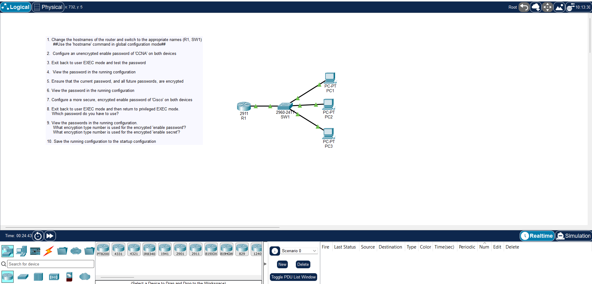

# Day 04 Lab: Intro to Cisco IOS CLI & Basic Device Security

## 1. Topology



---

## 2. Lab Objectives

- Get comfortable jumping between User EXEC, Privileged EXEC, and Global Configuration modes.
- Rename the router (`R1`) and switch (`SW1`).
- Lock down Privileged EXEC mode using both `enable password` and `enable secret`.
- Turn on `service password-encryption` to scramble plain-text passwords in the config file.
- Save the active configuration from RAM over to NVRAM so it survives a reboot.

---

## 3. CLI Configuration Walkthrough

### Step 1: Set Hostnames & Navigate Modes

Drop into Global Config mode from User EXEC and rename the router:

```ios
Router> enable
Router# configure terminal
Router(config)# hostname R1
R1(config)#
Step 2: Configure Access Passwords
Set up both the plain-text fallback password and the MD5-hashed secret, then turn on global password encryption:

# Set plain-text enable password
R1(config)# enable password CCNA

# Encrypt plain-text passwords stored in the config
R1(config)# service password-encryption

# Set hashed enable secret (this overrides the enable password)
R1(config)# enable secret Cisco123
R1(config)# end
4. Verification & Saving Configs
Code snippet
# 1. Check your configuration in RAM
R1# show running-config

# Note: If you're stuck in Global Config mode, use the 'do' prefix:
# R1(config)# do show running-config

# 2. Save active configuration to NVRAM
R1# copy running-config startup-config

# You can also use the shorthand:
R1# write memory
```
