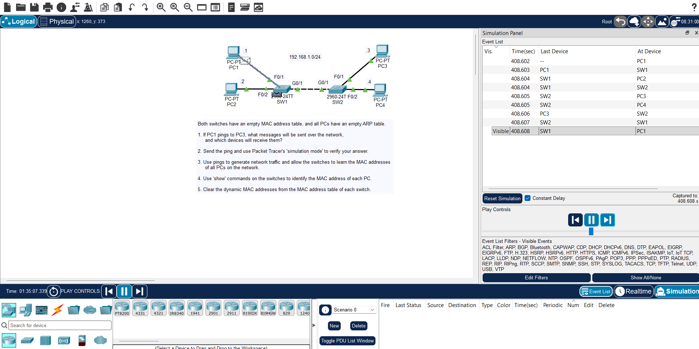

# Day 06 Lab: Ethernet LAN Switching, ARP & MAC Address Tables

## 1. Topology

---

## 2. Lab Objectives

- Observe how switches build and populate their MAC address table (CAM table) dynamically.
- Analyze how ARP (Address Resolution Protocol) resolves IP addresses to MAC addresses.
- Test end-to-end connectivity across switches using ICMP (`ping`).
- Inspect, verify, and clear MAC address table entries on Cisco Catalyst switches.

---

## 3. Step-by-Step Lab Walkthrough

### Step 1: Check Initial MAC Address Tables & ARP Caches

Before sending any traffic, verify that the switches have empty dynamic MAC address tables and the hosts have empty ARP caches:

# On Switch 1 and Switch 2

SW1# show mac address-table dynamic

# On PC1 terminal

PC1> arp -a
Step 2: Trigger ARP & Populate MAC Address Tables
From PC1, send a ping to PC3 (192.168.1.3):

PC1> ping 192.168.1.3
Open Simulation Mode (or observe in Realtime) to watch:

PC1 broadcast an ARP Request (FF:FF:FF:FF:FF:FF) to find PC3's MAC address.

Switches flood the broadcast frame out all ports except the receiving port.

PC3 reply with an ARP Reply (Unicast).

Switches record the Source MAC addresses into their MAC address table on the incoming ports.

Step 3: Inspect Learned MAC Addresses
Verify the MAC address entries created on the switches after traffic flowed:

# View all dynamically learned MAC addresses on the switch

SW1# show mac address-table dynamic

# View MAC addresses learned on a specific interface

SW1# show mac address-table interface fastEthernet 0/1
Step 4: Clear the MAC Address Table
Test flushing dynamic MAC address entries from switch memory:

# Clear dynamic MAC entries on SW1

SW1# clear mac address-table dynamic

# Verify the table is empty again

SW1# show mac address-table dynamic
