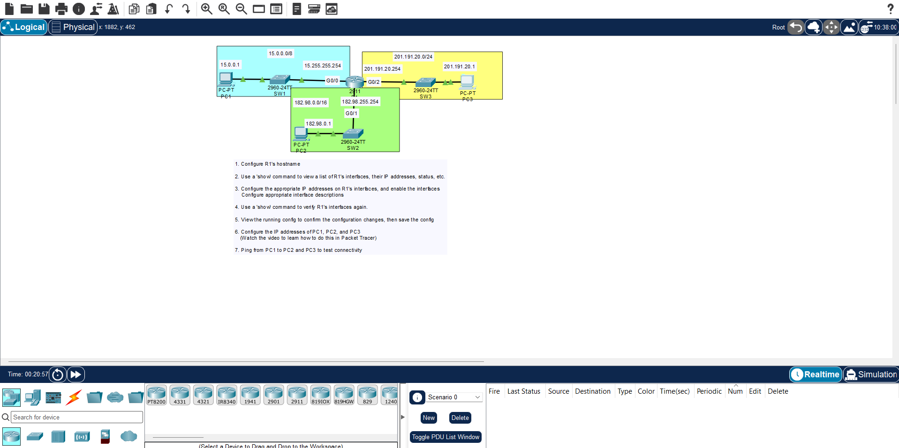

# Day 8: Configuring IPv4 Addresses (Part 2)



## Lab Objectives

- Calculate the network address, broadcast address, and total number of usable host IDs for specific subnets.
- Configure IPv4 addresses and subnet masks on Cisco router interfaces.
- Add interface descriptions for better network documentation.
- Bring up interfaces from their default administrative state (`no shutdown`).
- Assign IP addresses, subnets, and default gateways to end-host PCs.
- Verify configurations and end-to-end connectivity via `ping`.

## Configuration Syntax Reference

### 1. Assigning an IP Address to a Router Interface

```router-cli
Router# configure terminal
Router(config)# interface <interface-id>
Router(config-if)# ip address <ip-address> <subnet-mask>
Router(config-if)# description <text-description>
Router(config-if)# no shutdown


### 2. Verification Commands

- `show ip interface brief` — Displays summary of the IP address status and Layer 1/Layer 2 status of all interfaces.
- `show interfaces description` — Displays the configured description text of each interface.

## Key Study Takeaways

- **Default States:** Cisco **router** interfaces are `administratively down` (shutdown) by default and require the `no shutdown` command to activate. Cisco **switch** interfaces are usually active (`up/up`) by default out-of-the-box.
- **Host Calculation:** The formula to find the maximum number of usable host addresses in a network is `(2^n) - 2`, where `n` equals the number of host bits remaining.
- **Verification Status:** In `show ip interface brief`, the **Status** column shows the Layer 1 physical status, and the **Protocol** column shows the Layer 2 data link status.

```
