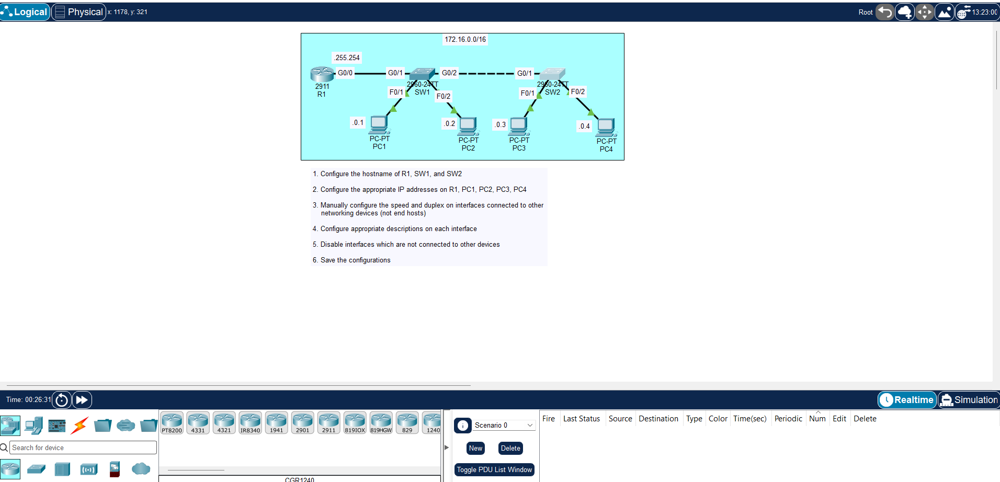

# Jeremy's IT Lab CCNA — Day 9 Lab Notes

Setup notes and CLI commands for Day 9 (Switch Interfaces & Basic Device Configuration).

---

## What We're Doing

- Bringing up router interfaces with IP addresses.
- Labelling ports with descriptions so we know what plugs into where.
- Manually setting speed and duplex on FastEthernet links.
- Setting up a Switch Virtual Interface (SVI) on VLAN 1 so SW1 has an IP address for management.
- Adding a default gateway on SW1 so we can reach it from another network.
- Verifying everything with `show` commands.

---

## Commands

### Router Port Config (R1)

Assign an IP, add a description, and turn the interface on:

R1# config t
R1(config)# int g0/0/0
R1(config-if)# description Link to SW1
R1(config-if)# ip address 192.168.1.1 255.255.255.0
R1(config-if)# no shut
R1(config-if)# exit

### Speed & Duplex (R1)

Locking speed and duplex manually on a FastEthernet link:

R1(config)# int f0/1
R1(config-if)# speed 100
R1(config-if)# duplex full

_Note: In Packet Tracer, forcing speed/duplex on Gigabit interfaces often breaks the link. Keep Gigabit ports on `auto` unless the lab specifically tells you otherwise._

### Switch Management IP & Default Gateway (SW1)

Switches don't put IPs directly on physical ports. You put the IP on `int vlan 1` and set `ip default-gateway` so you can SSH or ping it from outside the local subnet:

SW1# config t
SW1(config)# int vlan 1
SW1(config-if)# description Management
SW1(config-if)# ip address 192.168.1.2 255.255.255.0
SW1(config-if)# no shut
SW1(config-if)# exit

SW1(config)# ip default-gateway 192.168.1.1

---

## Verification

Run these from privileged EXEC mode (`#`):

show ip interface brief

Shows every interface, assigned IP, Layer 1 status, and Layer 2 protocol status at a glance.

show interfaces g0/0/0

Gives the full details for a specific port: MAC address, MTU, speed, duplex, and error counters.

show interfaces status

Switch-only command. Shows port status, assigned VLAN, speed, and duplex in a simple table.

---

## Quick Notes & Gotchas

- **Up / Up:** Physical layer is connected, data link is working. Good to go.
- **Down / Down:** Usually a dead cable, wrong port, or the device on the other side is turned off.
- **Administratively Down:** Port is disabled. Run `no shutdown` to fix it.
- **Up / Down:** Cable is physically fine, but there's a Layer 2 or duplex mismatch issue.
- **Auto-negotiation:** If auto-negotiation fails on a Cisco port, it drops down to 10 Mbps half-duplex (or full-duplex if it's a 1Gbps link).
- **Switch SVI:** `interface vlan 1` is purely for managing the switch itself over IP. It does not route traffic for connected PCs.
